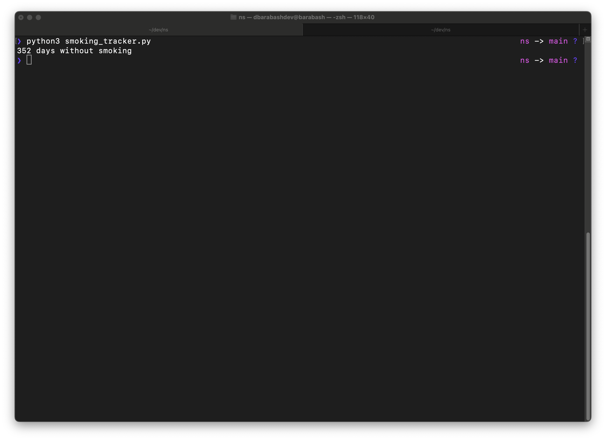

## Smoke-Free Days Tracker

### Overview

This Python script is designed to help you keep track of the number of days you've remained smoke-free. The motivation behind this script is to avoid using third-party applications for the same purpose. Instead, it allows you to maintain a simple record of your progress by counting the days and storing the results in a CSV file.



### Features

- Counts the number of smoke-free days.
- Records the progress in a CSV file.
- Easy integration with a locally written cron job for automated updates.

### Usage

To use this script, follow these steps:

1. Clone the repository to your local machine.
2. Configure a cron job to run the script at your desired intervals.
3. The script will update the CSV file with the number of smoke-free days.

### Example

```bash
# Clone the repository
git clone https://github.com/yourusername/smoke-free-tracker.git

# Configure a cron job to run the script daily
crontab -e

# Add the following line to run the script every day at 9 AM:
# 0 9 * * * /usr/bin/python3 /path/to/smoke-free-tracker/smoking_tracker.py

# Save and exit the cron job editor.
```
